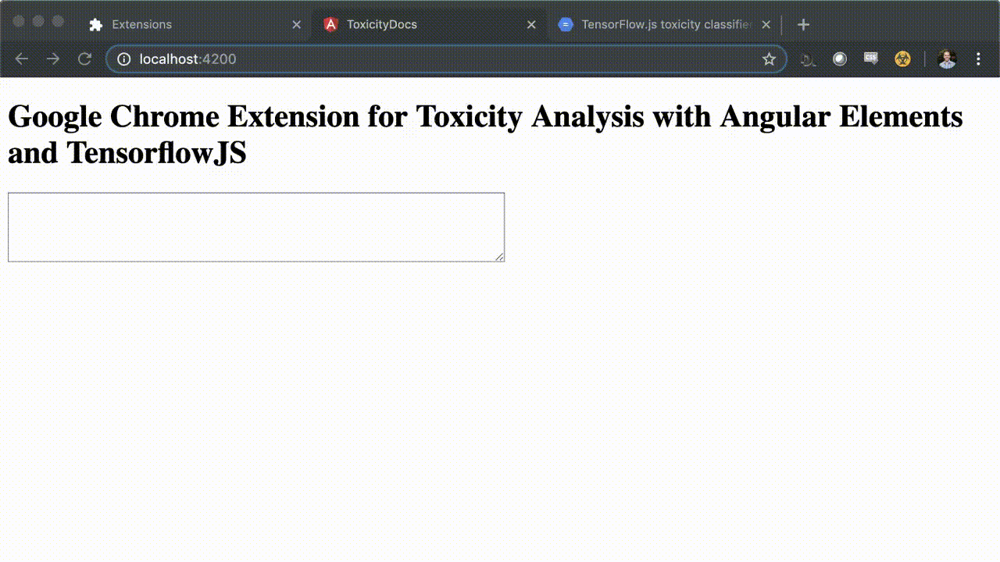

# Tensorflow Toxicity Chrome Extension

See my medium article here: https://medium.com/@martzcodes/are-you-a-jerk-dea5d1b2d7cc

## What is this?

It's a Google Chrome extension built using Angular Elements and TensorflowJS with a pre-trained NLP toxicity model.

## Build workflow

1. Bundle the toxicity-output / lib with `ng build --prod --single-bundle --output-hashing none --keep-polyfills`
2. Build the chrome extension with `npm run chrome`
3. Go to `chrome://extensions`
4. Turn on Dev mode
5. Load the Unpacked extension and point to the `dist/chrome` folder.
